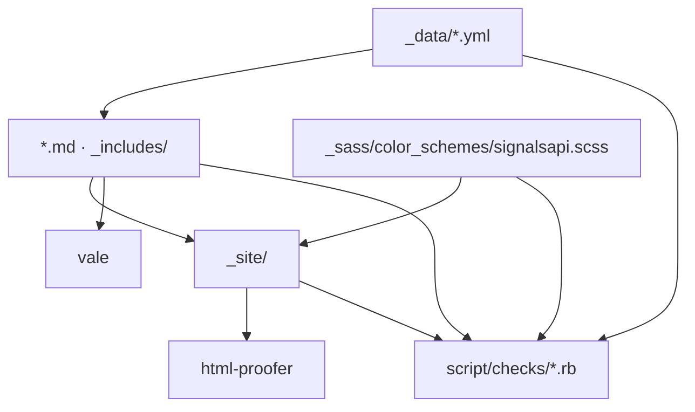
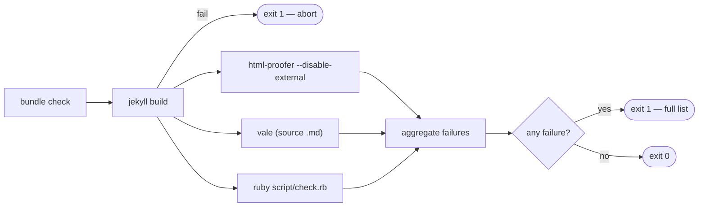
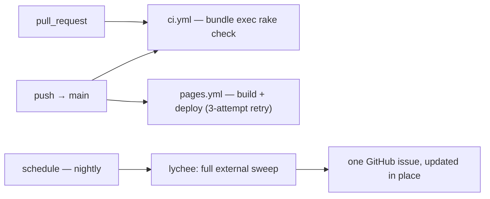

# Architecture Spine — SignalsAPI docs build and verification

## Design Paradigm

**Pipes and filters.** `bundle exec rake check` is a linear pipeline of independent
filters over one artifact. Each filter reads what the stage before it produced,
writes nothing back into the repository, and reports failure the same way.

```
bundle check → jekyll build → _site/ → { html-proofer | vale | script/check.rb } → aggregate → exit
```

Layer-to-directory map:

| Layer | Lives in | Role |
|---|---|---|
| Data | `_data/*.yml` | Single source of truth for every fact that appears on more than one page |
| Content | `*.md`, `_includes/`, `_sass/` | Renders data; owns no facts of its own |
| Artifact | `_site/` | Build output. Read-only to everything downstream, never committed |
| Verification | `Rakefile`, `script/check.rb`, `script/checks/*.rb`, `.vale.ini`, `styles/SignalsAPI/` | Proves the other three |
| Orchestration | `.github/workflows/` | Decides what runs on PR, on merge, and nightly |

The paradigm choice is the whole point of this workstream. Today `jekyll build`
exits 0 in 0.52 s with a dead link, a live template README, a self-contradicting
price, a double-slashed canonical URL on every page and 62 images with no alt
text. A build is not a filter — it transforms and nothing else. The architecture
adds the filters.

## Invariants & Rules



Arrows point one way only. No check writes. No page reads `_site/`. No data file
references a page. A cycle here is a defect, not a design.

### AD-1 — `rake check` is the only quality gate

- **Binds:** all
- **Prevents:** a second, divergent notion of "passing" — a lint someone runs by hand, a check that only exists in CI, a `jekyll build` treated as proof.
- **Rule:** every automated assertion about this repository is reachable from `bundle exec rake check`. CI runs exactly that command and nothing else on the PR path. A check that cannot be run on a contributor's machine does not exist.

### AD-2 — Two-clause Definition of Done

- **Binds:** every story in every epic
- **Prevents:** silent regression — the state the site is in now, where every defect was individually fixable and none stayed fixed.
- **Rule:** a story is done when **(a)** the change is made and **(b)** `bundle exec rake check` passes *and* at least one assertion exists that would fail if the change were reverted. Clause (b) is not waivable. Story 1.1 is the sole exception: it creates the harness clause (b) depends on.

### AD-3 — One assertion, one file

- **Binds:** `script/check.rb`, `script/checks/`
- **Prevents:** twenty assertions arriving from eleven epics colliding on the same lines of the same file. A story that hits a merge conflict skips clause (b), and clause (b) is the entire architecture.
- **Rule:** `script/check.rb` is a runner only. Every assertion is its own file at `script/checks/<slug>.rb`, auto-loaded by `Dir.glob`, self-registering:

```ruby
Check.register(
  id:     "canonical-no-double-slash",
  desc:   "No file under _site/ contains docs.signalsapi.com//",
  covers: ["2.1", "FR6"]
) do |site|
  site.html_files.each do |f|
    site.fail!("#{f.path} contains a double-slashed canonical") if f.body.include?("docs.signalsapi.com//")
  end
end
```

`rake check:new[canonical-no-double-slash]` scaffolds the file. Adding the
twentieth assertion costs one new file and touches nothing existing.

### AD-4 — The site model is parsed once

- **Binds:** `script/checks/*.rb`
- **Prevents:** twenty assertions each re-globbing 28 pages and each parsing YAML front matter its own way, with twenty subtly different ideas of what "a published page" means.
- **Rule:** the runner builds one `site` object before any check runs and passes it to every block. It exposes exactly: `pages` (source `.md` with parsed front matter and body), `html_files` (`_site/**/*.html`), `data` (the parsed `_data/` tree), `raw(path)`. A check that needs something else adds an accessor to the model in the same commit — it does not read the filesystem directly.

### AD-5 — Build aborts; checks aggregate

- **Binds:** `Rakefile`
- **Prevents:** twelve sequential CI round-trips to discover twelve findings.
- **Rule:** if `jekyll build` fails, `rake check` aborts immediately — nothing downstream has an artifact to read. If it succeeds, html-proofer, Vale and `script/check.rb` **all run to completion**, their failures are collected, and the task exits nonzero once at the end with the full list. Individual stages are addressable: `rake check:build`, `check:links`, `check:prose`, `check:assert`, `check:assert[<id>]`.



### AD-6 — Every check declares what it covers

- **Binds:** `script/checks/*.rb`, `_data/checks.yml`, `/docs-health`
- **Prevents:** clause (b) degrading into self-report — a story claiming an assertion exists with nothing able to contradict it.
- **Rule:** `Check.register` takes a `covers:` array of story and FR ids. `rake check:manifest` regenerates `_data/checks.yml` from the registry; an assertion fails if that file is stale, the same discipline as a lockfile. `/docs-health` renders it. `rake check:coverage` lists backlog items with no covering assertion.

### AD-7 — Facts live in `_data/`, in one envelope

- **Binds:** `_data/*.yml`
- **Prevents:** the F4 failure class — `faq.md:26` and `faq.md:51` stating prices that `features/find-phone-numbers.md:12` contradicts, with no mechanism able to notice.
- **Rule:** any fact appearing on more than one page lives in `_data/` and every page renders it through Liquid. Every data file is a mapping with exactly two top-level keys:

```yaml
meta:
  owner: '<github handle>'
  verified_on: '2026-08-01'
  source: '<where this came from>'
items:
  - key: value
```

One generic assertion validates that envelope for every file in `_data/`.
Per-file required keys are a plain Ruby array inside that file's own check.
**No schema library** — a docs repo does not import a validation framework to
check nine YAML files.

### AD-8 — Unsourceable figures ship as markers, never as numbers

- **Binds:** `_data/*.yml`, every page that renders a figure
- **Prevents:** the single highest-risk failure mode in this workstream — an invented price, credit cost, match rate, latency or uptime entering the corpus and becoming citable.
- **Rule:** where a figure is real but not derivable from this repository, the value is the literal string `TODO(owner: <handle>): <what is needed>`. Markers **never fail the build** — they are inventoried, rendered as a visible callout, and listed on `/docs-health`. A *malformed* marker (no handle, no description) **does** fail. A blocking marker would simply be deleted; a visible one is honest and shippable.

### AD-9 — Non-HTML output is produced by extension, not by layout

- **Binds:** `/llms.txt`, `/llms-full.txt`, `/robots.txt`, `/fixtures/v1/**.json`, `/plane-status.json`
- **Prevents:** the recurring mistake of authoring `llms.md` with `layout: null` and getting kramdown-converted HTML with a `.md`-derived URL.
- **Rule:** Jekyll converts **by source extension**. The source file is named with the *target* extension (`llms.txt`, `fixtures/v1/search.json`), carries front matter so Liquid renders it, and declares `layout: null` and an explicit `permalink:`. `sitemap.xml` is `jekyll-sitemap`'s and is not hand-authored.

### AD-10 — External links never gate a pull request

- **Binds:** `.github/workflows/`
- **Prevents:** a third-party outage reddening an unrelated PR, which trains contributors to merge past a red check.
- **Rule:** `html-proofer` runs `--disable-external` inside `rake check`. A nightly scheduled workflow runs `lychee` over the full external set and files or updates **one** GitHub issue. External-link rot is a maintenance queue, not a merge gate.

### AD-11 — The plugin budget is three

- **Binds:** `Gemfile`, `_config.yml`
- **Prevents:** unbounded plugin accretion in a repo whose custom Actions deploy makes every plugin legal. The absence of a whitelist is not a licence.
- **Rule:** this overhaul adds `jekyll-sitemap`, `jekyll-redirect-from`, `jekyll-seo-tag` — and no fourth without amending this spine. A plugin qualifies only if it replaces meaningful hand-rolled Liquid or does something Liquid cannot, is actively maintained, and lands with an assertion covering its output. `jekyll-seo-tag` carries a known duplicate-canonical risk against just-the-docs' own `head`; it is adopted **paired with** an assertion that every page emits exactly one `<link rel="canonical">`.

### AD-12 — `rake check` stays Ruby plus one binary

- **Binds:** `Rakefile`, contributor setup
- **Prevents:** the default developer loop acquiring a node toolchain for a file most stories never touch.
- **Rule:** `rake check` requires Ruby, the bundle, and the Vale binary. Vale is accepted because it is one static Go binary with no toolchain; `check:prose` fails with an actionable install line when it is missing. Spectral is **not** in `rake check` — OpenAPI linting is `rake lint:openapi` plus its own CI step. An assertion fails if `openapi.yaml` exists and `ci.yml` has no Spectral step, so the wiring cannot be forgotten.

### AD-13 — Ruby is pinned by file, enforced by warning

- **Binds:** `.ruby-version`, both workflows, `Gemfile`
- **Prevents:** the current split where CI pins 3.3 inline, the repo has no `.ruby-version`, local dev is 3.1.3, and local green does not prove CI green.
- **Rule:** add `.ruby-version` containing `3.3`; delete the inline `ruby-version:` key from `ci.yml` and `pages.yml` (`ruby/setup-ruby` reads the file). Do **not** add a `ruby` directive to the `Gemfile` — it breaks `bundle install` on 3.1.3 immediately. `rake check:env` **warns** on a mismatch between the running Ruby and `.ruby-version`; it does not fail. Blocking all local work behind an interpreter upgrade would stall the backlog on day one.

### AD-14 — A URL never simply stops working

- **Binds:** every page deletion or move
- **Prevents:** spending the site's only SEO asset. The URL surface is what this repository owns that cannot be rebuilt.
- **Rule:** a page may be deleted or moved only in a commit that also adds the corresponding `jekyll-redirect-from` entries, asserted by a check that compares the current page set against `_data/baseline.yml`. Navigation restructuring requires **no** redirects at all — just-the-docs resolves `parent:` by page title, not directory, so nesting is a front-matter edit.

### AD-15 — `_site/` is disposable

- **Binds:** all
- **Prevents:** a check "fixing" its own input, or generated output being committed and then hand-edited.
- **Rule:** `_site/` is gitignored, rebuilt from scratch every run, and read-only to every filter. No stage in the pipeline writes into the repository. `rake check:manifest` is the single exception and it is an explicit, separate task — never part of `check`.

## Consistency Conventions

| Concern | Convention |
|---|---|
| Check ids | kebab-case, describes the *invariant*, not the story: `nav-order-contiguous`, not `epic-2-fixes`. Unique; file name is `script/checks/<id>.rb`. |
| Check failure text | `<file>:<line> — <what is wrong>`. Actionable without opening the check. |
| Data file names | Plural noun, `_data/<plural>.yml`: `providers.yml`, `filters.yml`, `variables.yml`, `integrations.yml`, `glossary.yml`, `pricing.yml`, `pipeline.yml`, `screenshots.yml`, `baseline.yml`, `checks.yml`. |
| Data keys | `snake_case`. Ids are stable slugs, never array indices — a page links to `providers.items[key == 'leadmagic']`, never to position. |
| Dates | ISO `YYYY-MM-DD`, quoted, UTC. Applies to `verified_on`, `meta.verified_on`, `baseline.yml`. |
| Unsourceable value | `TODO(owner: <handle>): <what is needed>` — AD-8. |
| Front matter | The universal contract in EXPERIENCE.md § Page-Shape Conventions: `title`, `layout`, `nav_order`, `description`, `page_type`, `parent`. `strict_front_matter: true`. |
| Rake task names | `check` (all), `check:<stage>`, `check:assert[<id>]`, `check:new[<id>]`, `check:manifest`, `check:coverage`, `check:env`, `lint:openapi`. |
| Vale styles | `styles/SignalsAPI/<Rule>.yml`, one rule per file, named for what it denies: `NoLiveSandbox`, `Symptom.Titles`, `BacktickProse`. |
| Gemfile pins | Exact (`'0.10.0'`) for anything whose minor bump changes rendered output; `~>` for tooling. just-the-docs is exact — a theme minor silently restyles 28 pages. |
| Lockfile | `Gemfile.lock` committed. CI resolves frozen via `bundler-cache: true`. `rake check:build` runs `bundle check` first. |

## Stack

| Name | Version |
|---|---|
| Ruby | 3.3 (pinned by `.ruby-version`; local dev currently 3.1.3) |
| Bundler | 2.5.9 |
| Jekyll | 4.3.4 |
| just-the-docs | 0.10.0 (exact pin, not `~>`) |
| kramdown | 2.4, GFM input |
| rouge | 4.3 |
| jekyll-sitemap | latest at adoption |
| jekyll-redirect-from | latest at adoption |
| jekyll-seo-tag | latest at adoption |
| html-proofer | `~> 5` |
| Vale | current stable — Go binary, not a gem |
| Rake | Ruby stdlib / default gem |
| `script/check.rb` | plain Ruby stdlib only — no RSpec, no Minitest, no schema gem |
| Spectral | current stable — node, outside `rake check` (AD-12) |
| lychee | current stable — nightly only (AD-10) |
| Deployment | `.github/workflows/pages.yml` — a **custom** Actions workflow, not the GitHub Pages gem whitelist |

The deployment row is the most consequential fact in the repository. Because the
site is built by our own workflow and uploaded as a Pages artifact, arbitrary
Jekyll plugins and `_plugins/` generators are legal. Adding a plugin is exactly
two edits: a gem in the `Gemfile`, and a key under `plugins:` in `_config.yml` —
which does not exist yet and is created by the first plugin story. AD-11 is what
keeps that freedom from becoming sprawl.

Versions marked *latest at adoption* are deliberately unpinned in this spine and
must be resolved and written into the `Gemfile` by the story that adds them.
Naming a version here that was never installed would be exactly the unsourced
claim this project exists to eliminate.

## Structural Seed

```text
docs/
  Rakefile                      # rake check — the only gate (AD-1, AD-5)
  .ruby-version                 # 3.3 (AD-13)
  .vale.ini
  Gemfile · Gemfile.lock
  _config.yml                   # gains plugins:, exclude:, permalink:, defaults:, strict_front_matter:
  script/
    check.rb                    # runner + site model only (AD-3, AD-4)
    checks/                     # one file per assertion — the growth surface
  styles/SignalsAPI/            # one Vale rule per file
  _data/                        # the fact layer (AD-7)
  _includes/
    head_custom.html            # fonts, favicon, JSON-LD
    footer_custom.html          # the four nav_exclude'd pages
  _sass/
    color_schemes/signalsapi.scss   # palette — read by the contrast assertion
    custom/custom.scss
  concepts/ · quick-start/ · troubleshooting/ · apis/ · features/ · whats-new/
  fixtures/v1/                  # *.json, layout: null (AD-9)
  llms.txt · llms-full.txt · robots.txt · plane-status.json · 404.html
  .github/workflows/
    ci.yml                      # PR + push: bundle exec rake check
    pages.yml                   # push main: build + deploy, 3-attempt retry
    nightly.yml                 # lychee external sweep -> one issue (AD-10)
```

CI topology:



`pages.yml` is otherwise untouched. Its three-attempt deploy retry exists because
`actions/deploy-pages` intermittently returns *"Deployment failed, try again
later."* on identical artifacts — a server-side transient. Do not simplify it.

## Capability → Architecture Map

| Capability / Area | Lives in | Governed by |
|---|---|---|
| Verification harness (Epic 1) | `Rakefile`, `script/`, `.vale.ini`, `styles/` | AD-1, AD-2, AD-3, AD-4, AD-5, AD-12 |
| Credibility patch (Epic 2) | `_config.yml`, `faq.md`, `features/*.md` | AD-2, AD-11, AD-14 |
| Baseline (Epic 3) | `_data/baseline.yml`, `docs-baseline.md` | AD-7, AD-14 |
| Concepts and object model (Epic 4) | `_data/glossary.yml`, `concepts/` | AD-7, Vale conventions |
| Getting started (Epic 5) | `index.md`, `quick-start/` | EXPERIENCE.md page shapes, AD-2 |
| Troubleshooting (Epic 6) | `troubleshooting/` | EXPERIENCE.md `page_type: symptom`, AD-2 |
| `_data/` DRY refactor (Epic 7) | `_data/`, `_includes/` | AD-7, AD-8 |
| SEO and machine-readability (Epic 8) | `llms.txt`, `llms-full.txt`, `head_custom.html` | AD-9, AD-11, AD-14 |
| Trust and governance (Epic 9) | `docs-health.md`, `_data/checks.yml` | AD-6, AD-8 |
| Agent data plane, static subset (Epic 10) | `openapi.yaml`, `fixtures/v1/`, `plane-status.json` | AD-9, AD-12 |
| Content ops cleanup (Epic 11) | `whats-new/`, image set | AD-14, AD-15 |

## Deferred

- **Search relevance tuning.** The lunr index already works; `search_aliases` is a content lever, not an architectural one. Revisit only if aliases prove insufficient.
- **Image pipeline / responsive images.** 53 of 70 PNGs sit in `whats-new/`, whose fate is an open PRD question. Deciding a pipeline before deciding whether those files survive is premature.
- **A `_plugins/` generator.** Legal under the custom deploy, but nothing in this backlog yet needs generation that Liquid plus `_data/` cannot do. The first story that genuinely does amends AD-11.
- **Whether `check:env` escalates from warn to fail** (AD-13). Depends on the local interpreter being upgraded, which is outside this repository.
- **Staleness threshold for `verified_on`.** A policy number with no defensible default; it is a `TODO(owner:)` under AD-8 until set.
- **Anything requiring a runtime.** Live sandbox, hosted MCP server, analytics, feedback collection, zero-result logging. Out of scope by PRD § Scope, and no architecture here anticipates them.

## Open Questions

1. Three plugin versions are unresolved by design (see § Stack). The story that adds each must pin the version it actually installed.
2. `jekyll-seo-tag` against just-the-docs 0.10.0 is asserted-not-verified for canonical duplication. The pairing assertion in AD-11 is what turns that risk into a caught failure rather than a silent one — but the first run may need a `defaults:` adjustment.
3. Local Ruby 3.1.3 vs pinned 3.3 (AD-13) is a warning, not a gate. If the upgrade does not happen, some Ruby 3.3-only syntax in `script/checks/` could pass CI and fail locally — the inverse of today's problem. Keep `script/` to conservative syntax until resolved.
4. `bundle check` inside `check:build` assumes the contributor has run `bundle install`. Whether `rake check` should install on their behalf is a workflow preference, not an architectural call.
